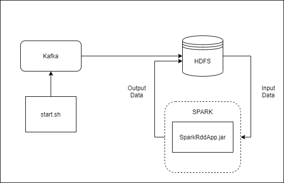

## Как запустить приложение

На хосте должен быть установлен maven
    
    cd /opt
    wget https://www-eu.apache.org/dist/maven/maven-3/3.6.3/binaries/apache-maven-3.6.3-bin.tar.gz
    tar xzf apache-maven-3.6.3-bin.tar.gz
    ln -s apache-maven-3.6.3 maven
    vi /etc/profile.d/maven.sh
    С содержимым
    export M2_HOME=/opt/maven
    export PATH=${M2_HOME}/bin:${PATH}

На хосте должен быть запущен `hadoop`

В директории `scripts` выполнить `./buildSparkApp.sh`

Запускаем в новых терминалах

    kafka_2.13-2.8.0/bin/zookeeper-server-start.sh config/zookeeper.properties
    kafka_2.13-2.8.0/bin/kafka-server-start.sh config/server.properties
    kafka_2.13-2.8.0/bin/kafka-topics.sh --create --topic spark-event --bootstrap-server localhost:9092

В новом терминале в папке `scripts` выполнить `./start <length array> <counts array>` 

### Cхема взаимодействия компонентов

